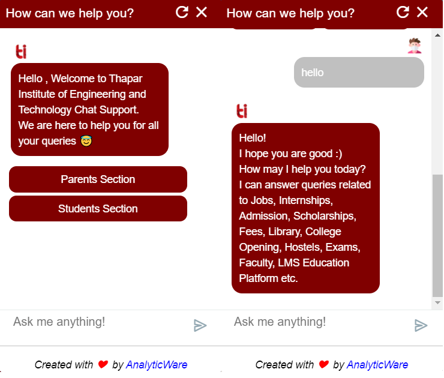

<h1 align="center">
   
  
   
    Thapar BOT
   
</h1>

<h4 align="center">A Deep Learning Intent based chatbot for Thapar Institute of Engineering & Technology, Patiala.</h4>
<h4 align="center">Deployed on <a href="http://thapar.edu">thapar.edu</a></h4>
 

 

## Technologies and Libraries

- python
- javascript
- jquery
- flask
- tensorflow
- flask_ngrok
- tflearn
- pickle
- NLTK
- numpy
- flask_cors

## Endpoint

- /chat

## License

By [Yashwant](https://github.com/meyash)

## Contributors

 

 

  
